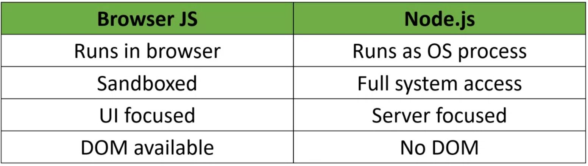

# Day 1: Introduction & JS Basics

## Course Logistics
* **Attendance:** Required and tracked.
* **Certification:** Based on completion criteria.
* **Workflow:** Overview of daily training schedule and goals.

---

## JS History
* **Founder:** Brendan Eich created JavaScript in 1995 (in 10 days) at Netscape to make web pages interactive.

---

## Browser JS Limitations (Security Sandbox)
* 🚫 **No File Access:** Cannot read or write files on the local machine.
* 🚫 **No Lifespan Guarantee:** Stops running when the tab/browser is closed.
* 🚫 **No OS Integration:** Cannot access low-level OS APIs, processes, or registry details.

---

## Node.js & Ryan Dahl
* **Creator:** Ryan Dahl (2009).
* **What is it?:** A runtime environment that runs JavaScript on the server/local machine (outside the browser).
* **Capabilities:** Full access to the file system, network interfaces, and low-level OS operations.

---

## V8 Engine
* **What is it?:** High-performance, open-source JS engine by Google (powers Chrome, Edge, Node.js, Deno).
* **How it works:** Compiles JS directly to native machine code (no line-by-line interpretation).
* **Workflow:** Source Code $\rightarrow$ **AST** (Parsing) $\rightarrow$ **Bytecode** (Ignition Interpreter) $\rightarrow$ **Optimized Machine Code** (TurboFan Compiler).

---

## Browser JS vs Node.js

---

## Why Node.js is Popular?
* **Full-Stack JS:** Same language for frontend and backend.
* **Fast APIs:** Extremely lightweight and efficient for API creation.
* **Easy Scaling:** Event-driven, non-blocking architecture allows handling massive traffic easily.

---

## JS is Asynchronous
* **Non-Blocking:** Heavy tasks (like API calls or timers) run in the background without blocking or halting the execution of subsequent code.