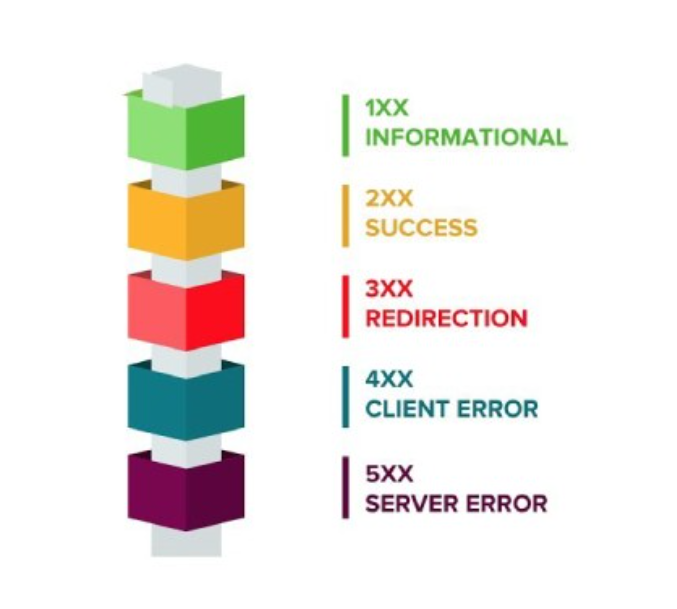
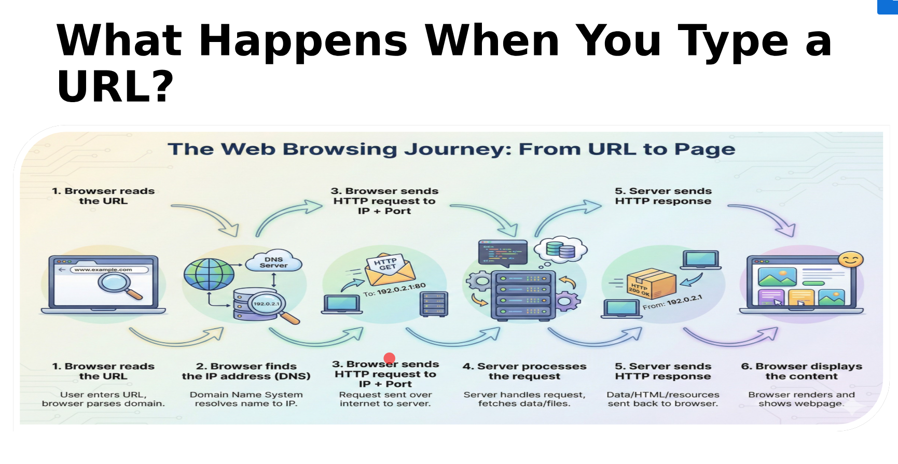
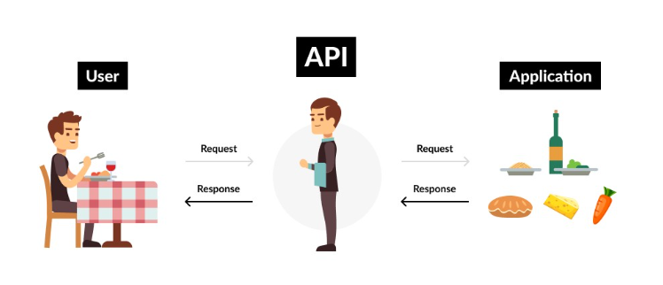

# Day 11: Compression & Decompression (Zlib) and Servers

## What is Zlib?

A **core Node.js module** (no installation needed) used to **compress** and **decompress** data using the Gzip algorithm.

- **Gzip** — compresses data
- **Gunzip** — decompresses data

```js
import z from 'zlib';
```

---

## Method 1: Compress/Decompress a String

### Compressing

```js
const text = "hello anshu this side";

z.gzip(text, (err, compressedData) => {
    if (err) {
        console.log(err);
        return;
    }
    console.log("Compressed:", compressedData);
});
```

> `compressedData` is a **Buffer** (binary data) — it won't look like readable text.

### Decompressing

```js
z.gunzip(compressedData, (err, decompressedData) => {
    if (err) {
        console.log(err);
        return;
    }
    console.log(decompressedData.toString()); // "hello anshu this side"
});
```

> Use `.toString()` to convert the Buffer back to a readable string.

---

## Method 2: Compress/Decompress Files Using Streams

### Compressing a File

```js
import fs from 'fs';

const rs = fs.createReadStream('data.txt');
const ws = fs.createWriteStream('data.txt.gz');
rs.pipe(z.createGzip()).pipe(ws);
```

> Reads `data.txt` → compresses it → writes to `data.txt.gz`.

### Decompressing a File

```js
const rs1 = fs.createReadStream('data.txt.gz');
const ws1 = fs.createWriteStream('data1.txt');
rs1.pipe(z.createGunzip()).pipe(ws1);
```

> Reads `data.txt.gz` → decompresses it → writes to `data1.txt`.

---

## ⚠️ Common Gotcha: Race Condition

If you compress and decompress in the same file, the decompression might start **before** compression finishes — causing a `Z_BUF_ERROR`.

**Fix:** Wait for compression to finish using the `finish` event.

```js
rs.pipe(z.createGzip()).pipe(ws);

ws.on('finish', () => {
    const rs1 = fs.createReadStream('data.txt.gz');
    const ws1 = fs.createWriteStream('data1.txt');
    rs1.pipe(z.createGunzip()).pipe(ws1);
});
```

---

## Quick Reference

| Method | What it does |
|--------|-------------|
| `z.gzip(data, callback)` | Compress a string/buffer |
| `z.gunzip(data, callback)` | Decompress a buffer |
| `z.createGzip()` | Returns a Gzip transform stream |
| `z.createGunzip()` | Returns a Gunzip transform stream |
| `.pipe()` | Connects streams: read → transform → write |

> **Key difference:** `z.gzip()` (lowercase) is the callback function. `z.Gzip` (uppercase) is the stream class — don't mix them up!

---

## Servers

A **server** is a combination of hardware and software that **listens for and fulfills client requests**.

> Client sends a request → Server processes it → Server sends back a response.

### How Servers Work

Servers communicate using **HTTP (HyperText Transfer Protocol)** — a set of rules for how data is transferred on the web.

---

## HTTP Methods

| Method | Purpose |
|--------|---------|
| `GET` | Retrieve/read data from the server |
| `POST` | Send/create new data on the server |
| `PUT` | Update/replace existing data entirely |
| `PATCH` | Update part of existing data |
| `DELETE` | Remove data from the server |

---

## HTTP Status Codes

| Code | Meaning |
|------|---------|
| `200` | OK — request succeeded |
| `201` | Created — new resource created successfully |
| `204` | No Content — success but nothing to return |
| `301` | Moved Permanently — resource URL changed |
| `400` | Bad Request — invalid request from client |
| `401` | Unauthorized — authentication required |
| `403` | Forbidden — authenticated but no permission |
| `404` | Not Found — resource doesn't exist |
| `500` | Internal Server Error — server crashed |

> **Quick rule:** `2xx` = success, `3xx` = redirect, `4xx` = client error, `5xx` = server error.





---

## API

An **API (Application Programming Interface)** is a communication interface that allows two software applications to **exchange data and functionality** using some predefined rules.

> Think of it as a **waiter** in a restaurant — you (client) tell the waiter (API) what you want, and the waiter brings it from the kitchen (server).



### Need of APIs

- Allows **different applications** to talk to each other (e.g., frontend ↔ backend)
- Provides **abstraction** — client doesn't need to know how the server works internally
- Enables **reusability** — one API can serve mobile apps, web apps, third-party services, etc.


---

## REST

**REST (Representational State Transfer)** — an architectural style introduced by **Roy Fielding** in 2000.

REST says resources should be accessed using **standard HTTP methods**:

| HTTP Method | CRUD Operation | Example |
|-------------|---------------|---------|
| `GET` | Read | Fetch a list of users |
| `POST` | Create | Add a new user |
| `PUT` | Update (full) | Replace user data entirely |
| `PATCH` | Update (partial) | Update just the user's email |
| `DELETE` | Delete | Remove a user |

### REST Principles

1. **Client-Server** — client and server are separate; they communicate via HTTP
2. **Stateless** — each request is independent; server doesn't remember previous requests
3. **Uniform Interface** — use standard URLs and HTTP methods (e.g., `GET /users`, `POST /users`)
4. **Resource-Based** — everything is a resource identified by a URL (e.g., `/users/1`)

> **RESTful API** = an API that follows REST principles.
